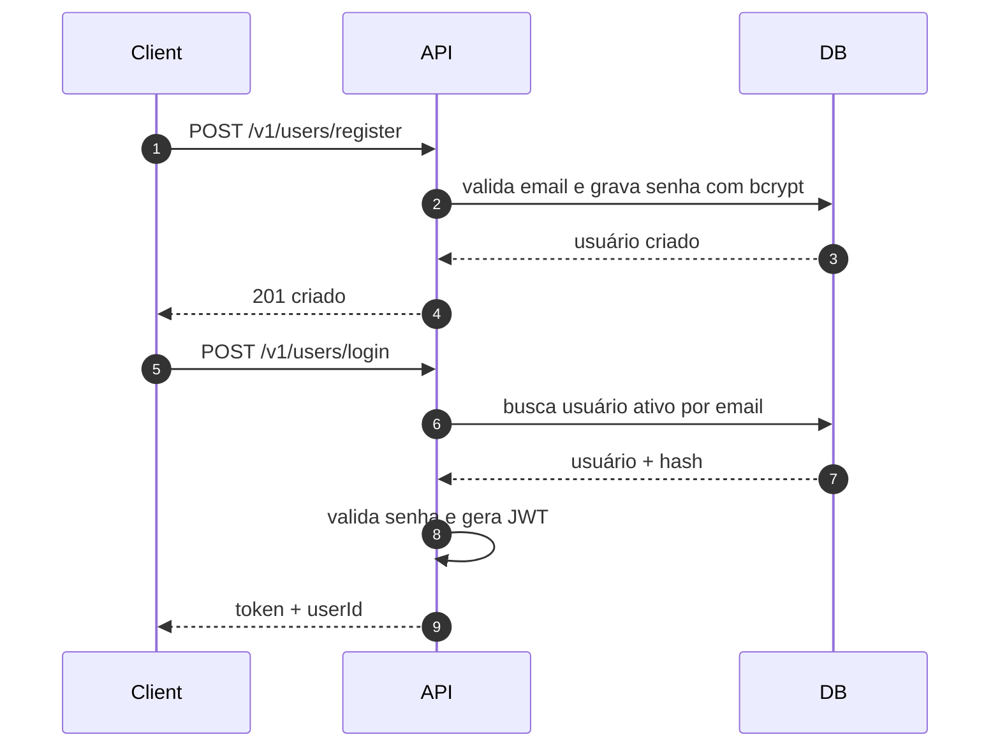
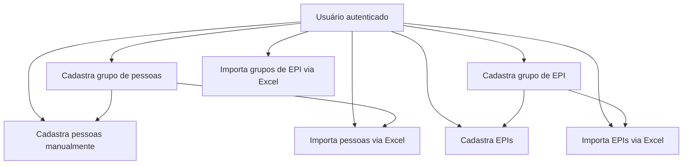
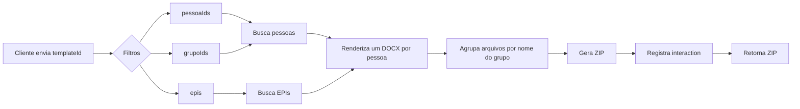

# Doc Filler API JS

Backend em Node.js/Express para cadastro de pessoas, grupos, EPIs, upload de templates `.docx` e geração automática de documentos preenchidos a partir de dados salvos no MySQL.

## Visão Geral

O projeto expõe uma API REST protegida por JWT. Cada usuário autenticado opera sobre seu próprio conjunto de dados:

- pessoas
- grupos de pessoas
- grupos de EPI
- EPIs
- templates de documentos
- histórico de interações/gerações

Os templates são armazenados em disco na pasta `uploads/` e seus metadados ficam no banco. Na geração, o backend busca os dados da pessoa e/ou dos EPIs, injeta no `.docx` com `docxtemplater` e devolve o arquivo preenchido.

## Stack

- Node.js
- Express
- MySQL (`mysql2/promise`)
- JWT (`jsonwebtoken`)
- bcrypt
- Multer
- `docxtemplater` + `pizzip`
- `xlsx`
- CORS

## Estrutura

```text
.
├── config/
├── controller/
├── helper/
├── middleware/
├── models/
├── routes/
├── script.sql
├── index.js
└── README.md
```

## Como Executar

1. Instale as dependências:

```bash
npm install
```

2. Crie o arquivo `.env` na raiz:

```env
PORT=3000
DB_HOST=localhost
DB_PORT=3306
DB_NAME=doc_filler
DB_USER=root
DB_PASS=senha
JWT_SECRET=sua_chave_jwt
```

3. Garanta que o MySQL esteja disponível e que o schema/tabelas do projeto já existam.

4. Crie a pasta de uploads se ela ainda não existir:

```bash
mkdir -p uploads
```

5. Inicie a aplicação:

```bash
npm start
```

Servidor padrão: `http://localhost:3000`

## Configuração Atual da API

- Prefixo principal das rotas: `/v1`
- Rotas de usuário: `/v1/users`
- CORS liberado para `http://localhost:3001`
- Autenticação via header `Authorization: Bearer <token>`

## Fluxos

### 1. Autenticação



### 2. Cadastro e Organização de Dados



### 3. Upload e Geração de Documento


### 4. Geração em Lote



## Entidades Principais

- `user`: autenticação e status do usuário
- `pessoa`: dados da pessoa vinculados ao `userId` e opcionalmente a `grupoId`
- `grupo_pessoa`: agrupamento de pessoas por usuário
- `grupo_epi`: agrupamento de EPIs por usuário
- `epis`: itens de EPI vinculados a `grupoEpiId` e `userId`
- `template`: metadados do arquivo de template salvo em `uploads/`
- `interactions`: histórico das gerações, incluindo `data_used`

Observação: o `script.sql` presente no repositório cobre apenas a tabela `interactions`, então o restante do schema precisa existir previamente no banco.

## Templates DOCX

O preenchimento usa as chaves do objeto enviado ao `docxtemplater`. Na prática:

- dados da pessoa são injetados diretamente no template
- `dataGeracaoDocumento` é adicionada automaticamente
- em fluxos com EPI, o template recebe um array `epis`

Exemplo conceitual de placeholders:

```text
{{nome}}
{{cpf}}
{{dataGeracaoDocumento}}
{{#epis}}
{{nome}} - {{qtd}}
{{/epis}}
```

## Endpoints

### Usuários

| Método | Rota | Descrição | Auth |
|---|---|---|---|
| POST | `/v1/users/register` | Cria usuário | Não |
| POST | `/v1/users/login` | Autentica e retorna JWT | Não |
| PUT | `/v1/users/status` | Atualiza status do usuário | Sim |

### Pessoas

| Método | Rota | Descrição | Auth |
|---|---|---|---|
| POST | `/v1/pessoas` | Cria pessoa | Sim |
| GET | `/v1/pessoas` | Lista pessoas com paginação | Sim |
| GET | `/v1/pessoas/:id` | Busca pessoa por id | Sim |
| PUT | `/v1/pessoas/:id` | Atualiza pessoa | Sim |
| DELETE | `/v1/pessoas/:id` | Remove pessoa | Sim |
| DELETE | `/v1/pessoas/delete-all` | Remove todas as pessoas do usuário | Sim |
| POST | `/v1/pessoas/import` | Importa pessoas via Excel | Sim |

### Grupo de Pessoas

| Método | Rota | Descrição | Auth |
|---|---|---|---|
| POST | `/v1/grupo` | Cria grupo de pessoas | Sim |
| GET | `/v1/grupo` | Lista grupos de pessoas | Sim |
| GET | `/v1/grupo/:id` | Busca grupo por id | Sim |
| PUT | `/v1/grupo/:id` | Atualiza grupo | Sim |
| DELETE | `/v1/grupo/:id` | Remove grupo | Sim |

### Grupo de EPI

| Método | Rota | Descrição | Auth |
|---|---|---|---|
| POST | `/v1/grupo-epi` | Cria grupo de EPI | Sim |
| GET | `/v1/grupo-epi` | Lista grupos de EPI | Sim |
| GET | `/v1/grupo-epi/:id` | Busca grupo de EPI por id | Sim |
| PUT | `/v1/grupo-epi/:id` | Atualiza grupo de EPI | Sim |
| DELETE | `/v1/grupo-epi/:id` | Remove grupo de EPI | Sim |
| POST | `/v1/grupo-epi/import` | Importa grupos de EPI via Excel | Sim |

### EPIs

| Método | Rota | Descrição | Auth |
|---|---|---|---|
| POST | `/v1/epi` | Cria EPI | Sim |
| GET | `/v1/epi` | Lista EPIs com paginação | Sim |
| GET | `/v1/epi/:id` | Busca EPI por id | Sim |
| GET | `/v1/epi/grupo/:id` | Lista EPIs por grupo | Sim |
| PUT | `/v1/epi/:id` | Atualiza EPI | Sim |
| DELETE | `/v1/epi/:id` | Remove EPI | Sim |
| POST | `/v1/epi/import` | Importa EPIs via Excel | Sim |

### Templates e Geração de Documentos

| Método | Rota | Descrição | Auth |
|---|---|---|---|
| POST | `/v1/templates` | Faz upload de template | Sim |
| GET | `/v1/templates/:id` | Busca template por id | Sim |
| GET | `/v1/templates/user/:userid` | Lista templates por usuário | Sim |
| GET | `/v1/templates/:userid/download?arquivo=...` | Faz download do template físico | Sim |
| PUT | `/v1/templates/:id` | Atualiza metadados do template | Sim |
| DELETE | `/v1/templates/:id` | Remove template e arquivo | Sim |
| GET | `/v1/fill-docx-template/:idtemplate/pessoa/:idpessoa` | Gera um DOCX para uma pessoa | Sim |
| POST | `/v1/fill-docx-template/:idtemplate/pessoa/:idpessoa/epi` | Gera um DOCX para uma pessoa com EPIs | Sim |
| POST | `/v1/fill-docx-template/batch` | Gera documentos em lote e retorna ZIP | Sim |
| POST | `/v1/fill-docx-template/batch/epi` | Gera documentos em lote com EPIs e retorna ZIP | Sim |

### Interações

| Método | Rota | Descrição | Auth |
|---|---|---|---|
| POST | `/v1/interactions` | Cria interação manualmente | Sim |
| GET | `/v1/interactions` | Lista histórico de gerações | Sim |

## Paginação

As listagens principais usam os parâmetros:

- `page`
- `pageSize`

E retornam:

- `data`
- `page`
- `pageSize`
- `totalPages`
- header `X-Total-Count`

## Exemplos de Uso

### Login

```bash
curl -X POST http://localhost:3000/v1/users/login \
  -H "Content-Type: application/json" \
  -d '{"email":"admin@teste.com","password":"123456"}'
```

### Criar pessoa

```bash
curl -X POST http://localhost:3000/v1/pessoas \
  -H "Authorization: Bearer TOKEN" \
  -H "Content-Type: application/json" \
  -d '{"nome":"Maria","cpf":"00000000000","grupoId":1}'
```

### Upload de template

```bash
curl -X POST http://localhost:3000/v1/templates \
  -H "Authorization: Bearer TOKEN" \
  -F "descricao=Ficha de registro" \
  -F "tipoTemplate=admissao" \
  -F "file=@./modelo.docx"
```

### Geração em lote com EPIs

```bash
curl -X POST http://localhost:3000/v1/fill-docx-template/batch/epi \
  -H "Authorization: Bearer TOKEN" \
  -H "Content-Type: application/json" \
  -d '{
    "templateId": 1,
    "grupoIds": [2],
    "epis": [
      { "id": 10, "quantidade": 1 },
      { "id": 11, "quantidade": 2 }
    ]
  }'
```

## Pontos de Atenção no Código Atual

- o script `npm start` usa `nodemon`
- não há suíte de testes configurada
- o CORS está fixado em `http://localhost:3001`
- há inconsistências pontuais de nomenclatura entre `userId` e `userid` no acesso ao banco
- o histórico de interações depende da coluna `data_used` em JSON

## Próximos Melhoramentos Sugeridos

- versionar o schema completo do banco
- adicionar validação de payload
- padronizar nomenclatura de colunas e respostas
- mover configurações de CORS para ambiente
- adicionar testes de integração para os fluxos de geração
