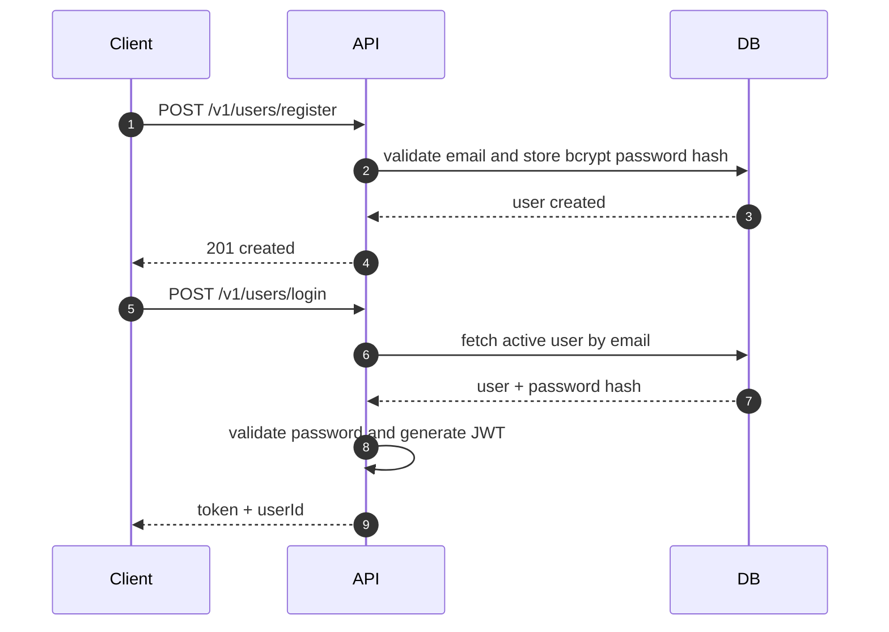
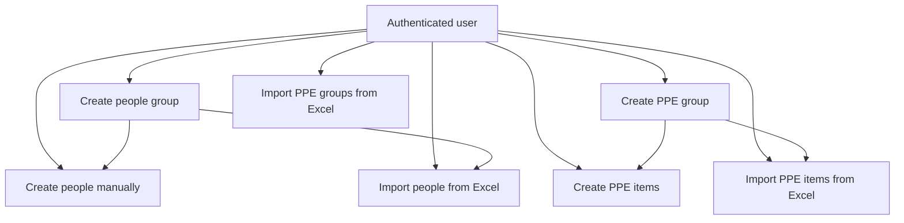
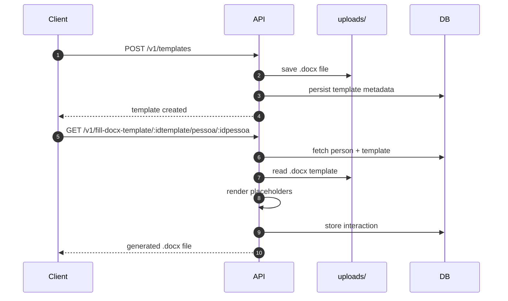
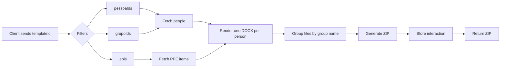

# Doc Filler API JS

Node.js/Express backend for managing people, groups, PPE items, `.docx` template uploads, and automatic document generation based on data stored in MySQL.

## Overview

The project exposes a JWT-protected REST API. Each authenticated user works only with their own data set:

- people
- people groups
- PPE groups
- PPE items
- document templates
- generation/interaction history

Template files are stored on disk under `uploads/`, while their metadata is stored in the database. During document generation, the backend fetches person and/or PPE data, injects it into a `.docx` template with `docxtemplater`, and returns the generated file.

## Stack

- Node.js
- Express
- MySQL (`mysql2/promise`)
- JWT (`jsonwebtoken`)
- bcrypt
- Multer
- `docxtemplater` + `pizzip`
- `xlsx`
- CORS

## Project Structure

```text
.
├── config/
├── controller/
├── helper/
├── middleware/
├── models/
├── routes/
├── script.sql
├── index.js
└── README.md
```

## Running Locally

1. Install dependencies:

```bash
npm install
```

2. Create a `.env` file in the project root:

```env
PORT=3000
DB_HOST=localhost
DB_PORT=3306
DB_NAME=doc_filler
DB_USER=root
DB_PASS=password
JWT_SECRET=your_jwt_secret
```

3. Make sure MySQL is available and that the project schema/tables already exist.

4. Create the uploads directory if it does not exist yet:

```bash
mkdir -p uploads
```

5. Start the application:

```bash
npm start
```

Default server URL: `http://localhost:3000`

## Current API Configuration

- Main route prefix: `/v1`
- User routes: `/v1/users`
- CORS currently allows `http://localhost:3001`
- Authentication uses `Authorization: Bearer <token>`

## Flows

### 1. Authentication



### 2. Data Registration and Organization



### 3. Template Upload and Document Generation



### 4. Batch Generation



## Main Entities

- `user`: user authentication and status
- `pessoa`: person data linked to `userId` and optionally `grupoId`
- `grupo_pessoa`: user-owned people group
- `grupo_epi`: user-owned PPE group
- `epis`: PPE item linked to `grupoEpiId` and `userId`
- `template`: uploaded file metadata stored alongside the physical file in `uploads/`
- `interactions`: document generation history, including `data_used`

Note: the repository `script.sql` currently covers only the `interactions` table, so the rest of the schema must already exist in the target database.

## DOCX Templates

The rendering step uses the keys present in the object sent to `docxtemplater`. In practice:

- person fields are injected directly into the template
- `dataGeracaoDocumento` is added automatically
- in PPE-related flows, the template receives an `epis` array

Conceptual placeholder example:

```text
{{nome}}
{{cpf}}
{{dataGeracaoDocumento}}
{{#epis}}
{{nome}} - {{qtd}}
{{/epis}}
```

## Endpoints

### Users

| Method | Route | Description | Auth |
|---|---|---|---|
| POST | `/v1/users/register` | Create user | No |
| POST | `/v1/users/login` | Authenticate and return JWT | No |
| PUT | `/v1/users/status` | Update user status | Yes |

### People

| Method | Route | Description | Auth |
|---|---|---|---|
| POST | `/v1/pessoas` | Create person | Yes |
| GET | `/v1/pessoas` | List people with pagination | Yes |
| GET | `/v1/pessoas/:id` | Get person by id | Yes |
| PUT | `/v1/pessoas/:id` | Update person | Yes |
| DELETE | `/v1/pessoas/:id` | Delete person | Yes |
| DELETE | `/v1/pessoas/delete-all` | Delete all people for the authenticated user | Yes |
| POST | `/v1/pessoas/import` | Import people from Excel | Yes |

### People Groups

| Method | Route | Description | Auth |
|---|---|---|---|
| POST | `/v1/grupo` | Create people group | Yes |
| GET | `/v1/grupo` | List people groups | Yes |
| GET | `/v1/grupo/:id` | Get people group by id | Yes |
| PUT | `/v1/grupo/:id` | Update people group | Yes |
| DELETE | `/v1/grupo/:id` | Delete people group | Yes |

### PPE Groups

| Method | Route | Description | Auth |
|---|---|---|---|
| POST | `/v1/grupo-epi` | Create PPE group | Yes |
| GET | `/v1/grupo-epi` | List PPE groups | Yes |
| GET | `/v1/grupo-epi/:id` | Get PPE group by id | Yes |
| PUT | `/v1/grupo-epi/:id` | Update PPE group | Yes |
| DELETE | `/v1/grupo-epi/:id` | Delete PPE group | Yes |
| POST | `/v1/grupo-epi/import` | Import PPE groups from Excel | Yes |

### PPE Items

| Method | Route | Description | Auth |
|---|---|---|---|
| POST | `/v1/epi` | Create PPE item | Yes |
| GET | `/v1/epi` | List PPE items with pagination | Yes |
| GET | `/v1/epi/:id` | Get PPE item by id | Yes |
| GET | `/v1/epi/grupo/:id` | List PPE items by group | Yes |
| PUT | `/v1/epi/:id` | Update PPE item | Yes |
| DELETE | `/v1/epi/:id` | Delete PPE item | Yes |
| POST | `/v1/epi/import` | Import PPE items from Excel | Yes |

### Templates and Document Generation

| Method | Route | Description | Auth |
|---|---|---|---|
| POST | `/v1/templates` | Upload template | Yes |
| GET | `/v1/templates/:id` | Get template by id | Yes |
| GET | `/v1/templates/user/:userid` | List templates by user | Yes |
| GET | `/v1/templates/:userid/download?arquivo=...` | Download physical template file | Yes |
| PUT | `/v1/templates/:id` | Update template metadata | Yes |
| DELETE | `/v1/templates/:id` | Delete template and physical file | Yes |
| GET | `/v1/fill-docx-template/:idtemplate/pessoa/:idpessoa` | Generate one DOCX for one person | Yes |
| POST | `/v1/fill-docx-template/:idtemplate/pessoa/:idpessoa/epi` | Generate one DOCX for one person with PPE items | Yes |
| POST | `/v1/fill-docx-template/batch` | Generate batch documents and return ZIP | Yes |
| POST | `/v1/fill-docx-template/batch/epi` | Generate batch documents with PPE items and return ZIP | Yes |

### Interactions

| Method | Route | Description | Auth |
|---|---|---|---|
| POST | `/v1/interactions` | Create interaction manually | Yes |
| GET | `/v1/interactions` | List generation history | Yes |

## Pagination

Main listing endpoints use:

- `page`
- `pageSize`

And return:

- `data`
- `page`
- `pageSize`
- `totalPages`
- `X-Total-Count` response header

## Usage Examples

### Login

```bash
curl -X POST http://localhost:3000/v1/users/login \
  -H "Content-Type: application/json" \
  -d '{"email":"admin@teste.com","password":"123456"}'
```

### Create Person

```bash
curl -X POST http://localhost:3000/v1/pessoas \
  -H "Authorization: Bearer TOKEN" \
  -H "Content-Type: application/json" \
  -d '{"nome":"Maria","cpf":"00000000000","grupoId":1}'
```

### Upload Template

```bash
curl -X POST http://localhost:3000/v1/templates \
  -H "Authorization: Bearer TOKEN" \
  -F "descricao=Registration form" \
  -F "tipoTemplate=admission" \
  -F "file=@./template.docx"
```

### Batch Generation With PPE

```bash
curl -X POST http://localhost:3000/v1/fill-docx-template/batch/epi \
  -H "Authorization: Bearer TOKEN" \
  -H "Content-Type: application/json" \
  -d '{
    "templateId": 1,
    "grupoIds": [2],
    "epis": [
      { "id": 10, "quantidade": 1 },
      { "id": 11, "quantidade": 2 }
    ]
  }'
```

## Current Codebase Notes

- `npm start` runs the app with `nodemon`
- there is no test suite configured
- CORS is hardcoded to `http://localhost:3001`
- there are some naming inconsistencies between `userId` and `userid` in database access
- interaction history depends on a JSON `data_used` column

## Suggested Next Improvements

- version the full database schema
- add request payload validation
- standardize column and response naming
- move CORS settings to environment variables
- add integration tests for document generation flows
